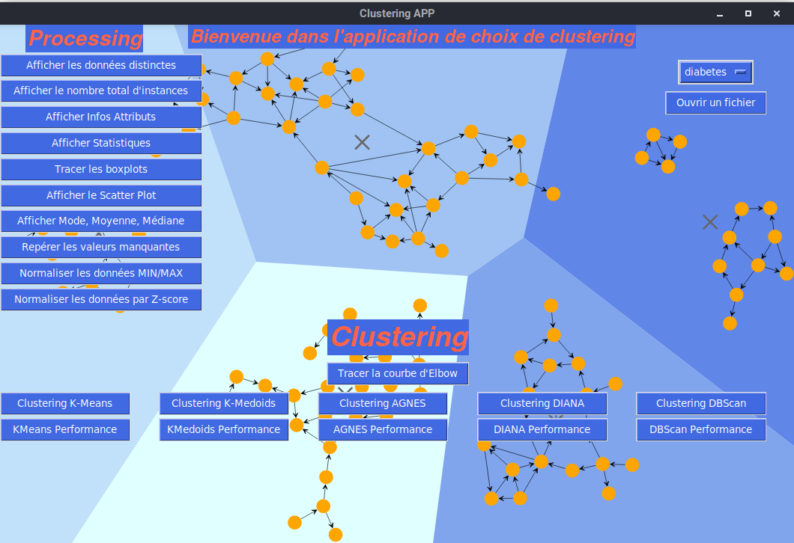
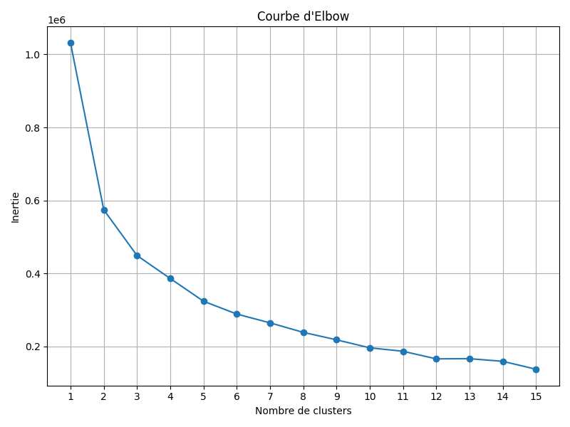

# Data Analysis and Clustering Application
This project, developed in Python with Jupyter and Tkinter, is a complete application for data exploration and the application of various clustering algorithms. It was carried out as part of the Data Mining module (M1 Bioinformatics, USTHB).
The application offers an intuitive graphical interface allowing to carry out a complete data mining pipeline, from preprocessing to cluster performance evaluation.
## 📸 Screenshots

*Main application interface offering preprocessing and clustering tools.*

*Example of the Elbow method to determine the optimal number of clusters.*
## ✨ Features
### 1. Preprocessing and Exploratory Data Analysis (EDA)
- **Data Loading:** Opening `.csv` and `.arff` files.
- **Exploration:** Display of distinct values, number of instances, attribute information.
- **Descriptive Statistics:** Calculation of Min, Max, Mean, Median and Quartiles.
- **Visualization:** Generation of **Boxplots** and **Scatter plots** to analyze distributions and correlations.
- **Cleaning:** Detection and replacement of missing values.
- **Normalization:** Data scaling via **Min/Max** and **Z-score** methods.
### 2. Clustering Algorithms
The application implements and compares 5 major clustering algorithms:
- **K-Means:** Based on centroids.
- **K-Medoids:** Robust variant using medoids.
- **AGNES (Agglomerative Nesting):** Hierarchical agglomerative clustering.
- **DIANA (Divisive Analysis):** Hierarchical divisive clustering.
- **DBSCAN (Density-Based):** Density-based clustering, capable of finding arbitrary shapes.
### 3. Performance Evaluation
- **Elbow Method:** To determine the optimal number of clusters (k).
- **Inertia Measures:** Calculation of within-cluster and between-cluster inertia.
- **Clustering Scores:** Evaluation via **Silhouette Score**, **Calinski-Harabasz Index** and **Davies-Bouldin Index**.
## 🛠️ Technologies and Libraries
- **Python 3**
- **Tkinter** for the graphical interface (GUI)
- **Jupyter Notebook** for the development environment
- **Pandas** & **Numpy** for data manipulation
- **Scikit-learn** & **Scikit-learn-extra** for clustering algorithms and preprocessing
- **Matplotlib** & **Seaborn** for data visualization
- **Kneed** for Elbow curve analysis
## 🚀 How to Use
1.  **Clone the repository:**
    ```bash
    git clone https://github.com/YOUR_USERNAME/Data-Clustering-Toolkit.git
    cd Data-Clustering-Toolkit
    ```
2.  **Install dependencies:**
    ```bash
    pip install -r requirements.txt
    ```
3.  **Launch Jupyter Notebook:**
    ```bash
    jupyter notebook
    ```
4.  In the Jupyter interface, navigate to the `notebook/` folder and open `Clustering_Analysis.ipynb`.
5.  Execute the notebook cells. The last cell will launch the Tkinter graphical application.

## 📌 Citation
If you use this project, please cite it as:

Ayoub Laib (2025), *Data Analysis and Clustering Application*, GitHub repository: https://github.com/aylaib/Data-Clustering-Toolkit


## 📚 Reference Documents
- **[Complete Project Report](./Rapport_Projet_Clustering.pdf)** : Detailed analysis, methodology, results and conclusions.
